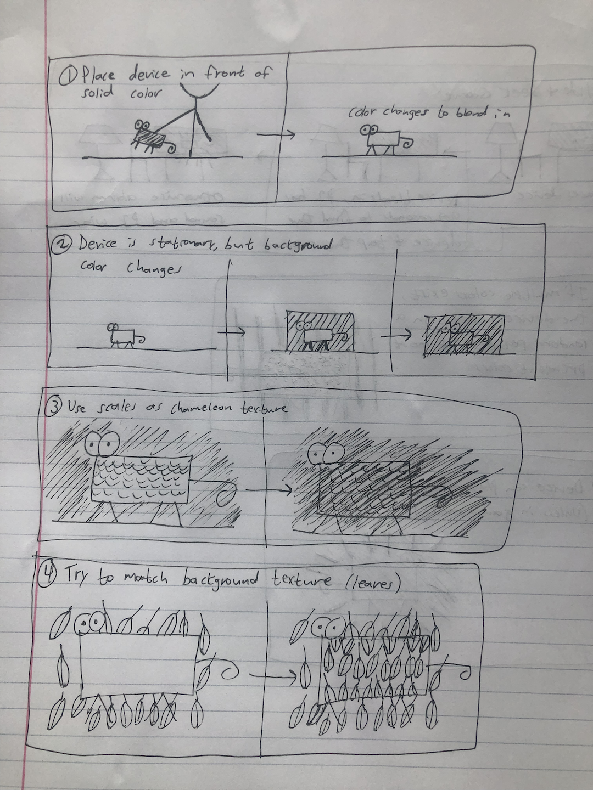
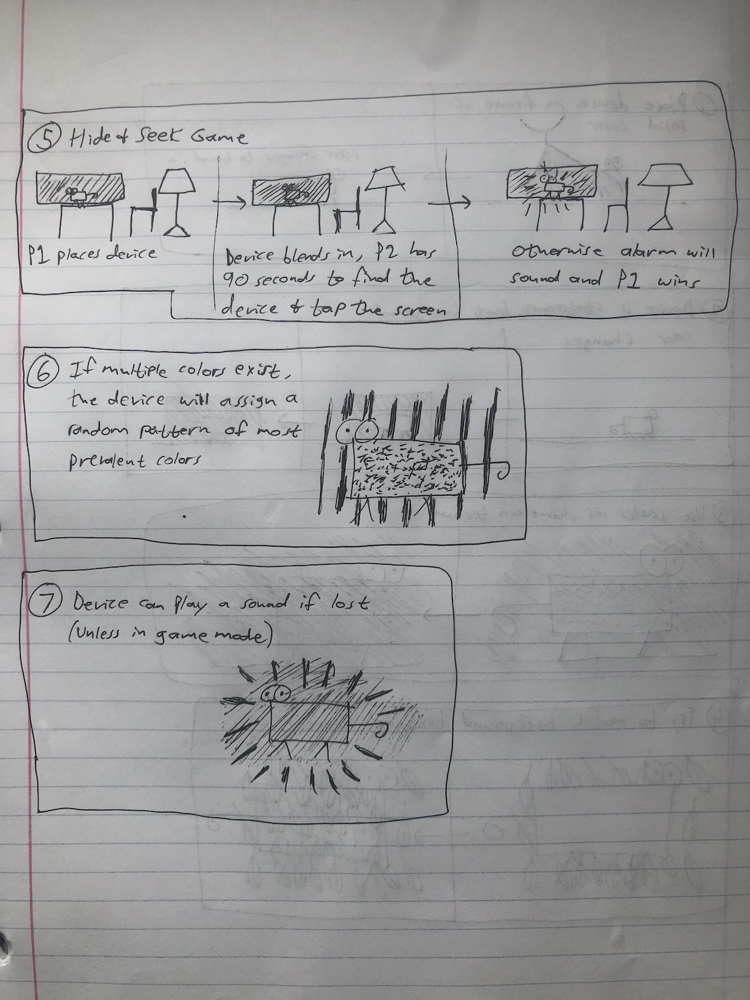
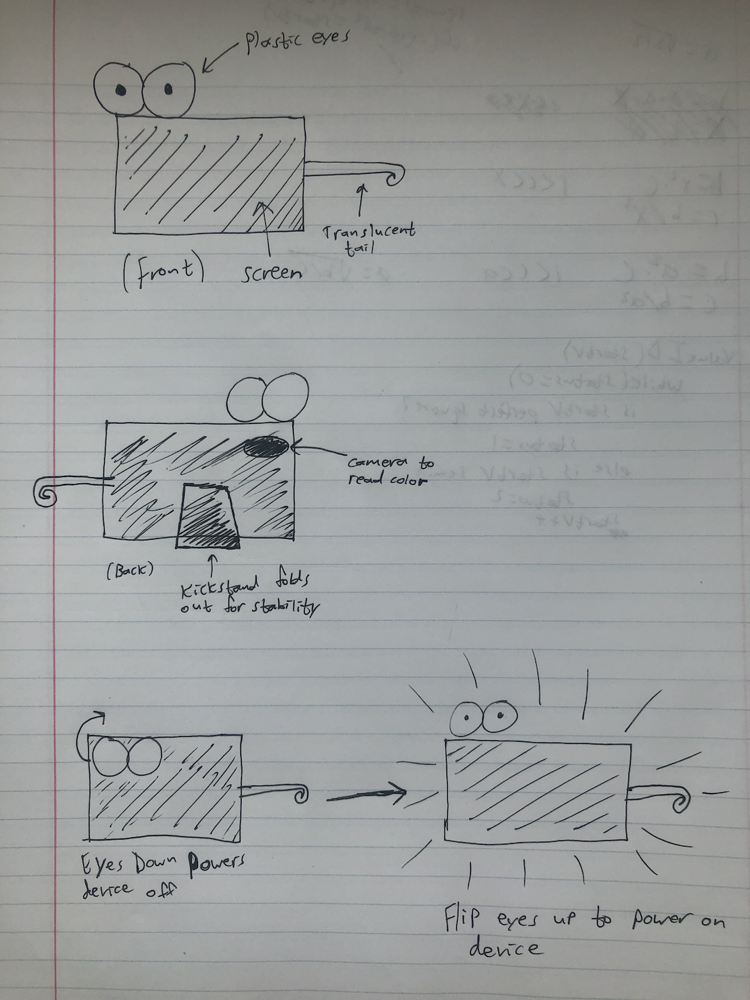

# Staging Interaction

In the original stage production of Peter Pan, Tinker Bell was represented by a darting light created by a small handheld mirror off-stage, reflecting a little circle of light from a powerful lamp. Tinkerbell communicates her presence through this light to the other characters. See more info [here](https://en.wikipedia.org/wiki/Tinker_Bell). 

There is no actor that plays Tinkerbell--her existence in the play comes from the interactions that the other characters have with her.

For lab this week, we draw on this and other inspirations from theatre to stage interactions with a device where the main mode of display/output for the interactive device you are designing is lighting. You will plot the interaction with a storyboard, and use your computer and a smartphone to experiment with what the interactions will look and feel like. 

_Make sure you read all the instructions and understand the whole of the laboratory activity before starting!_

## Prep

### To start the semester, you will need:
1. Read about Git [here](https://git-scm.com/book/en/v2/Getting-Started-What-is-Git%3F).
2. Set up your own Github "Lab Hub" repository to keep all you work in record by [following these instructions](https://github.com/FAR-Lab/Developing-and-Designing-Interactive-Devices/blob/2021Fall/readings/Submitting%20Labs.md).
3. Set up the README.md for your Hub repository (for instance, so that it has your name and points to your own Lab 1) and [learn how to](https://guides.github.com/features/mastering-markdown/) organize and post links to your submissions on your README.md so we can find them easily.

### For this lab, you will need:
1. Paper
2. Markers/ Pens
3. Scissors
4. Smart Phone -- The main required feature is that the phone needs to have a browser and display a webpage.
5. Computer -- We will use your computer to host a webpage which also features controls.
6. Found objects and materials -- You will have to costume your phone so that it looks like some other devices. These materials can include doll clothes, a paper lantern, a bottle, human clothes, a pillow case, etc. Be creative!

### Deliverables for this lab are: 
1. 7 Storyboards
1. 3 Sketches/photos of costumed devices
1. Any reflections you have on the process
1. Video sketch of 3 prototyped interactions
1. Submit the items above in the lab1 folder of your class [Github page], either as links or uploaded files. Each group member should post their own copy of the work to their own Lab Hub, even if some of the work is the same from each person in the group.

### The Report
This README.md page in your own repository should be edited to include the work you have done (the deliverables mentioned above). Following the format below, you can delete everything but the headers and the sections between the **stars**. Write the answers to the questions under the starred sentences. Include any material that explains what you did in this lab hub folder, and link it in your README.md for the lab.

## Lab Overview
For this assignment, you are going to:

A) [Plan](#part-a-plan) 

B) [Act out the interaction](#part-b-act-out-the-interaction) 

C) [Prototype the device](#part-c-prototype-the-device)

D) [Wizard the device](#part-d-wizard-the-device) 

E) [Costume the device](#part-e-costume-the-device)

F) [Record the interaction](#part-f-record)

Labs are due on Mondays. Make sure this page is linked to on your main class hub page.

## Part A. Plan 

\*\***Describe your setting, players, activity and goals here.**\*\*

The interactive device that I am prototyping is a chameleon toy that will read the color of the background that it is put in front of and change color to blend in. The setting is anywhere the user chooses to place the device, but for the purpose of example I will be sticking with areas around a home during the day. The main players are the user(s) and the device, as most bystanders might not even notice the device because of how well it blends in! The users should take to care to avoid getting in the way of anyone else while using the device, however. The activity is as follows: the user will place the device in a location of their choosing, and then the device with automatically sense the color of the area that it was placed in and change its color to blend in. As stated, the goal of the device is to blend in with its surroundings. The goal of the user is to make it so others do not notice the device.

\*\***Include pictures of your storyboards here**\*\*

\*\***Summarize feedback you got here.**\*\*

One thing that might be a good idea is a more extensive UI. Currently there is no button to power on/off, no indication of a sleep function, no indication of volume control, etc. Furthemore, it is not specified how the brightness of the device will adapt to low light/bright settings in order to aid in blending in.

## Part B. Act out the Interaction

\*\***Are there things that seemed better on paper than acted out?**\*\*

To act out the interaction, I simply used Tinkerbell to match the phone color with the background color. One thing that stands out is that it might be a good idea to have some sort of interface to indicate when to change color to blend in with the background.

\*\***Are there new ideas that occur to you or your collaborators that come up from the acting?**\*\*

I think the original feedback is reinforced, that it would be helpful to include some kind of user interface to better control the device.

## Part C. Prototype the device

\*\***Give us feedback on Tinkerbelle.**\*\*
I thought it ran pretty smoothly, the only thing I found odd was I had to restart it a few times in order for it to work on my phone. Other than that I had no problems.

## Part D. Wizard the device

\*\***Include your first attempts at recording the set-up video here.**\*\*

[![Device Wizarding]](https://drive.google.com/file/d/1Dv6p8K7cJp-_OiqcWRwPrkeZXu1VrVlM/view?usp=sharing)

\*\***Show the follow-up work here.**\*\*

The biggest problem I ran into was trying to find a good way to stand up the device. In the video above, I simply had it resting against another object. To streamline this, I added a kickstand to the back of the device. See the costume sketch below for a visual example.

## Part E. Costume the device

\*\***Include sketches of what your devices might look like here.**\*\*

\*\***What concerns or opportunitities are influencing the way you've designed the device to look?**\*\*

Since the device is meant to be hidden, I wanted to avoid having too many costume components that would make the device stand out. So I kept it simple and added eyes in kind of a camo green color, and a transluscent tail. If I had more resources, I would probably try and find items that were completely transparent, or somehow extend the color changing properties to these items. Another option would be to just try and add the costume components digitally to the screen itself.

## Part F. Record

\*\***Take a video of your prototyped interaction.**\*\*

[![Prototype]](https://drive.google.com/file/d/1T4XjXjlTxjxsIthOTso3aCJW3oed_wSv/view?usp=sharing)

\*\***Please indicate anyone you collaborated with on this Lab.**\*\*
Thanks to my friends for giving feedback on my initial device design.

# Staging Interaction, Part 2 

This describes the second week's work for this lab activity.

## Prep (to be done before Lab on Wednesday)

You will be assigned three partners from another group. Go to their github pages, view their videos, and provide them with reactions, suggestions & feedback: explain to them what you saw happening in their video. Guess the scene and the goals of the character. Ask them about anything that wasn’t clear. 

\*\***Summarize feedback from your partners here.**\*\*

## Make it your own

Do last week’s assignment again, but this time: 
1) It doesn’t have to (just) use light, 
2) You can use any modality (e.g., vibration, sound) to prototype the behaviors! Again, be creative! Feel free to fork and modify the tinkerbell code! 
3) We will be grading with an emphasis on creativity. 

\*\***Document everything here. (Particularly, we would like to see the storyboard and video, although photos of the prototype are also great.)**\*\*
