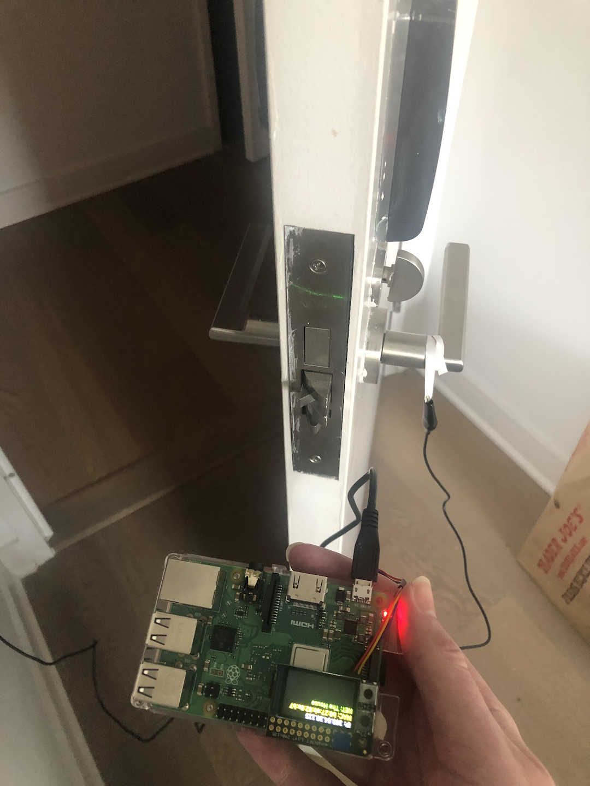
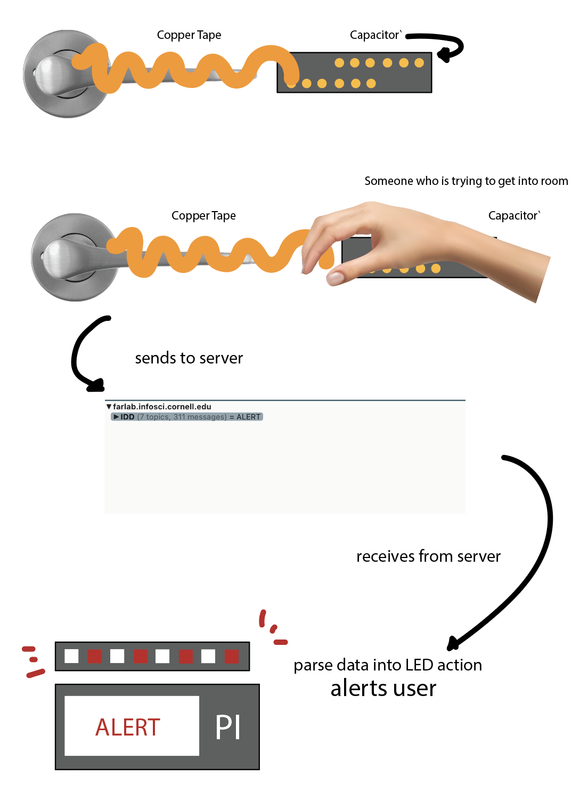

# Little Interactions Everywhere

**NAMES OF COLLABORATORS HERE**

Grace Nho

## Prep

1. Pull the new changes from the class interactive-lab-hub. (You should be familiar with this already!)
2. Install [MQTT Explorer](http://mqtt-explorer.com/) on your laptop. If you are using Mac, MQTT Explorer only works when installed from the [App Store](https://apps.apple.com/app/apple-store/id1455214828).
3. Readings before class:
   * [MQTT](#MQTT)
   * [The Presence Table](https://dl.acm.org/doi/10.1145/1935701.1935800) and [video](https://vimeo.com/15932020)


## Overview

The point of this lab is to introduce you to distributed interaction. We have included some Natural Language Processing (NLP) and Generation (NLG) but those are not really the emphasis. Feel free to dig into the examples and play around the code which you can integrate into your projects if wanted. However, we want to emphasize that the grading will focus on your ability to develop interesting uses for messaging across distributed devices. Here are the four sections of the lab activity:

A) [MQTT](#part-a)

B) [Send and Receive on your Pi](#part-b)

C) [Streaming a Sensor](#part-c)

D) [The One True ColorNet](#part-d)

E) [Make It Your Own](#part-)

## Part 1.

### Part A
### MQTT

MQTT is a lightweight messaging portal invented in 1999 for low bandwidth networks. It was later adopted as a defacto standard for a variety of [Internet of Things (IoT)](https://en.wikipedia.org/wiki/Internet_of_things) devices. 

#### The Bits

* **Broker** - The central server node that receives all messages and sends them out to the interested clients. Our broker is hosted on the far lab server (Thanks David!) at `farlab.infosci.cornell.edu/8883`. Imagine that the Broker is the messaging center!
* **Client** - A device that subscribes or publishes information to/on the network.
* **Topic** - The location data gets published to. These are *hierarchical with subtopics*. For example, If you were making a network of IoT smart bulbs this might look like `home/livingroom/sidelamp/light_status` and `home/livingroom/sidelamp/voltage`. With this setup, the info/updates of the sidelamp's `light_status` and `voltage` will be store in the subtopics. Because we use this broker for a variety of projects you have access to read, write and create subtopics of `IDD`. This means `IDD/ilan/is/a/goof` is a valid topic you can send data messages to.
*  **Subscribe** - This is a way of telling the client to pay attention to messages the broker sends out on the topic. You can subscribe to a specific topic or subtopics. You can also unsubscribe. Following the previouse example of home IoT smart bulbs, subscribing to `home/livingroom/sidelamp/#` would give you message updates to both the light_status and the voltage.
* **Publish** - This is a way of sending messages to a topic. Again, with the previouse example, you can set up your IoT smart bulbs to publish info/updates to the topic or subtopic. Also, note that you can publish to topics you do not subscribe to. 


**Important note:** With the broker we set up for the class, you are limited to subtopics of `IDD`. That is, to publish or subcribe, the topics will start with `IDD/`. Also, setting up a broker is not much work, but for the purposes of this class, you should all use the broker we have set up for you!


#### Useful Tooling

Debugging and visualizing what's happening on your MQTT broker can be helpful. We like [MQTT Explorer](http://mqtt-explorer.com/). You can connect by putting in the settings from the image below.


Once connected, you should be able to see all the messages under the IDD topic. , go to the **Publish** tab and try publish something! From the interface you can send and plot messages as well. Remember, you are limited to subtopics of `IDD`. That is, to publish or subcribe, the topics will start with `IDD/`.


### Part B
### Send and Receive on your Pi

[sender.py](./sender.py) and and [reader.py](./reader.py) show you the basics of using the mqtt in python. Let's spend a few minutes running these and seeing how messages are transferred and shown up. Before working on your Pi, keep the connection of `farlab.infosci.cornell.edu/8883` with MQTT Explorer running on your laptop.

**Running Examples on Pi**

* Install the packages from `requirements.txt` under a virtual environment, we will continue to use the `circuitpython` environment we setup earlier this semester:

  ```
  pi@raspberrypi:~/Interactive-Lab-Hub $ source circuitpython/bin/activate
  (circuitpython) pi@raspberrypi:~/Interactive-Lab-Hub $ cd Lab\ 6
  (circuitpython) pi@raspberrypi:~/Interactive-Lab-Hub/Lab 6 $ pip install -r requirements.txt
  ...
  ```
* Run `sender.py`, fill in a topic name (should start with `IDD/`), then start sending messages. You should be able to see them on MQTT Explorer.

  ```
  (circuitpython) pi@raspberrypi:~/Interactive-Lab-Hub/Lab 6 $ python sender.py
  >> topic: IDD/AlexandraTesting
  now writing to topic IDD/AlexandraTesting
  type new-topic to swich topics
  >> message: testtesttest
  ...
  ```
* Run `reader.py`, and you should see any messages being published to `IDD/` subtopics. Type a message inside MQTT explorer and see if you can receive it with `reader.py`.

  ```
  (circuitpython) pi@raspberrypi:~ Interactive-Lab-Hub/Lab 6 $ python reader.py
  ...
  ```


**\*\*\*Consider how you might use this messaging system on interactive devices, and draw/write down 5 ideas here.\*\*\***

1. Door touch sensor - connect the capacitive touch sensor to the inner handle of a door. If the handles are connected through the door, then the sensor will be able to tell when somebody is touching the outer doorknob, and can alert the user through messaging if somebody is trying to enter

2. Room occupation - Place light sensors within a set of conference rooms, and stream this data to the user's device with the messaging system. The user will then be able to tell how many conference rooms are free/full based on whether or not the lights are on without having to make the trip and look around.

3. Preheat alert - The device could be connected to an oven, and could remotely alert the user when their oven has finished preheating, as well as giving them live updates on the temperature, all through the messaging system.

4. Cat door alerts - A senser could be placed on a cat door, and could message the user's device when it detects their cat entering/exiting through the cat door. This way the user could know whether or not their cat is home or out and about.

5. Trash can capacity - Numerous devices could be attached to weight sensors placed under trash cans, to help indicate how full the trash cans are. This data could be sent to a central device via messaging, allowing the user to know when they need to empty the trash cans.

### Part C
### Streaming a Sensor

We have included an updated example from [lab 4](https://github.com/FAR-Lab/Interactive-Lab-Hub/tree/Fall2021/Lab%204) that streams the [capacitor sensor](https://learn.adafruit.com/adafruit-mpr121-gator) inputs over MQTT. We will also be running this example under `circuitpython` virtual environment.

Plug in the capacitive sensor board with the Qwiic connector. Use the alligator clips to connect a Twizzler (or any other things you used back in Lab 4) and run the example script:

<p float="left">


</p>

 ```
 (circuitpython) pi@raspberrypi:~ Interactive-Lab-Hub/Lab 6 $ python distributed_twizzlers_sender.py
 ...
 ```

**\*\*\*Include a picture of your setup here: what did you see on MQTT Explorer?\*\*\***



I hooked the device up to the doorknob inside of my bedroom. Since the doorknobs were connected through the door, the device would send an alert if someone was to touch the outer handle. On the MQTT explorer, I could see that the contact I had connected to the door was touched, as the message was sent onto the 'IDD/James' topic.

**\*\*\*Pick another part in your kit and try to implement the data streaming with it.\*\*\***

I used the Qwiic button, code can be found in button_sender.py


### Part D
### The One True ColorNet

It is with great fortitude and resilience that we shall worship at the altar of the *OneColor*. Through unity of the collective RGB, we too can find unity in our heart, minds and souls. With the help of machines, we can overthrow the bourgeoisie, get on the same wavelength (this was also a color pun) and establish [Fully Automated Luxury Communism](https://en.wikipedia.org/wiki/Fully_Automated_Luxury_Communism).

The first step on the path to *collective* enlightenment, plug the [APDS-9960 Proximity, Light, RGB, and Gesture Sensor](https://www.adafruit.com/product/3595) into the [MiniPiTFT Display](https://www.adafruit.com/product/4393). You are almost there!

<p float="left">
  
  
  
</p>


The second step to achieving our great enlightenment is to run `color.py`. We have talked about this sensor back in Lab 2 and Lab 4, this script is similar to what you have done before! Remember to activate the `circuitpython` virtual environment you have been using during this semester before running the script:

 ```
 (circuitpython) pi@raspberrypi:~ Interactive-Lab-Hub/Lab 6 $ python color.py
 ...
 ```

By running the script, wou will find the two squares on the display. Half is showing an approximation of the output from the color sensor. The other half is up to the collective. Press the top button to share your color with the class. Your color is now our color, our color is now your color. We are one.

(A message from the previous TA, Ilan: I was not super careful with handling the loop so you may need to press more than once if the timing isn't quite right. Also, I haven't load-tested it so things might just immediately break when everyone pushes the button at once.)

You may ask "but what if I missed class?" Am I not admitted into the collective enlightenment of the *OneColor*?

Of course not! You can go to [https://one-true-colornet.glitch.me/](https://one-true-colornet.glitch.me/) and become one with the ColorNet on the inter-webs. Glitch is a great tool for prototyping sites, interfaces and web-apps that's worth taking some time to get familiar with if you have a chance. Its not super pertinent for the class but good to know either way. 

**\*\*\*Can you set up the script that can read the color anyone else publish and display it on your screen?\*\*\***

Code can be found in readColor.py


### Part E
### Make it your own

Find at least one class (more are okay) partner, and design a distributed application together based on the exercise we asked you to do in this lab.

**\*\*\*1. Explain your design\*\*\*** For example, if you made a remote controlled banana piano, explain why anyone would want such a thing.

"Touch-Security" The capactive sensor will be attached to the door knob and the pi will sense whenever someone touches the pi, send the information over to the receiver pi (in this case, the user), and the user will be alerted when someone trespasses into their room. This is helpful to the user both for safety concerns, as well as for simple convenience, as they might be expecting a guest, and the system would alert them when their guest has entered through their door.

**\*\*\*2. Diagram the architecture of the system.\*\*\*** Be clear to document where input, output and computation occur, and label all parts and connections. For example, where is the banana, who is the banana player, where does the sound get played, and who is listening to the banana music?



**\*\*\*3. Build a working prototype of the system.\*\*\*** Do think about the user interface: if someone encountered these bananas somewhere in the wild, would they know how to interact with them? Should they know what to expect?

For the "intruder" it is designed so that they do not know about the system at all. The device is set up behind the door so that the intruder is not aware of what is going on at the other side of the door. If the user on the inside encountered the device, after seeing a device hooked up to a door with a receiver, and seeing that the light on the receiver started to flash red, it's likely that the user would get a clear indication that something was going on with the door, and it probably wouldn't take long for them to understand that someone was trying to get in through the door.

**\*\*\*4. Document the working prototype in use.\*\*\*** It may be helpful to record a Zoom session where you should the input in one location clearly causing response in another location.

https://drive.google.com/file/d/1RqNAOXabPUq43KtBmaDKhqTolrRKhl31/view?usp=share_link

<!--**\*\*\*5. BONUS (Wendy didn't approve this so you should probably ignore it)\*\*\*** get the whole class to run your code and make your distributed system BIGGER.-->

